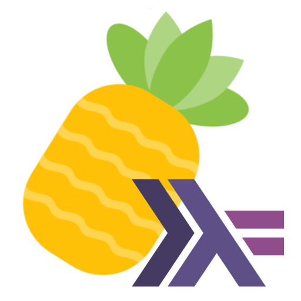
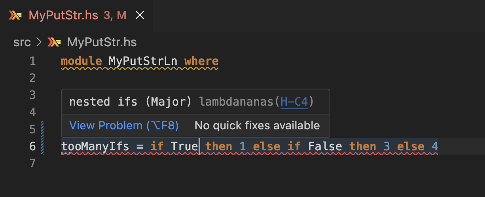
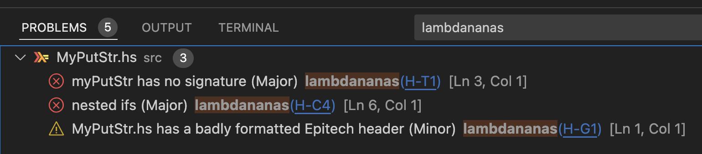

#  Language Server for Lambdananas

This repository contains the Language Server for [Lambdananas](https://github.com/Epitech/lambdananas/), EPITECH's Haskell Coding Style Checker. It is compatible with VSCode and Neovim.

## Features

- See Lambdananas' warnings in your IDE
- Quick access to EPITECH's Coding Style Documentation




## Installation

### 1 - Install Lambdananas

```bash
git clone git@github.com:Epitech/lambdananas.git
cd lambdananas
stack install
```

### 2 - Install the Language Server

```bash
git clone git@github.com:Arthi-chaud/lambdananas-language-server.git
cd lambdananas-language-server 
stack install
```

These steps may take a while. Once installed, you can safely delete the cloned directories.

### 3 - Setup the Language Server for your IDE

#### VSCode

- Go to the Extension Tab
- Search for 'Lambdananas for VSCode'
- Click `Install`
- You're done :white_check_mark:

:point_right: Marketplace [Link](https://marketplace.visualstudio.com/items?itemName=Arthi-chaud.lambdananas-coding-style-checker)

#### Neovim

Use `nvim-lspconfig` to plug the Language Server to Neovim. In your configuration, add the following lines:

```lua
local setup_lambdananas = function()
	local lspconfig = require("lspconfig")
	local configs = require("lspconfig.configs")

	if not configs.lambdananas then
		configs.lambdananas = {
			default_config = {
				cmd = { "lambdananas-language-server", "." },
				filetypes = { "haskell", "lhaskell" },
				root_dir = lspconfig.util.root_pattern("stack.yaml", "*.cabal", "package.yaml"),
				single_file_support = true,
			},
		}
	end
	lspconfig.lambdananas.setup({})
end

setup_lambdananas()
```

### How to update

- To update Lambdananas, repeat step 1.
- To update the Language Server, repeat step 2.

## Contributing

Want to contribute? Or spotted a bug? Feel free to open a [pull request](https://github.com/Arthi-chaud/lambdananas-language-server/compare) or an [issue](https://github.com/Arthi-chaud/lambdananas-language-server/issues/new) !
